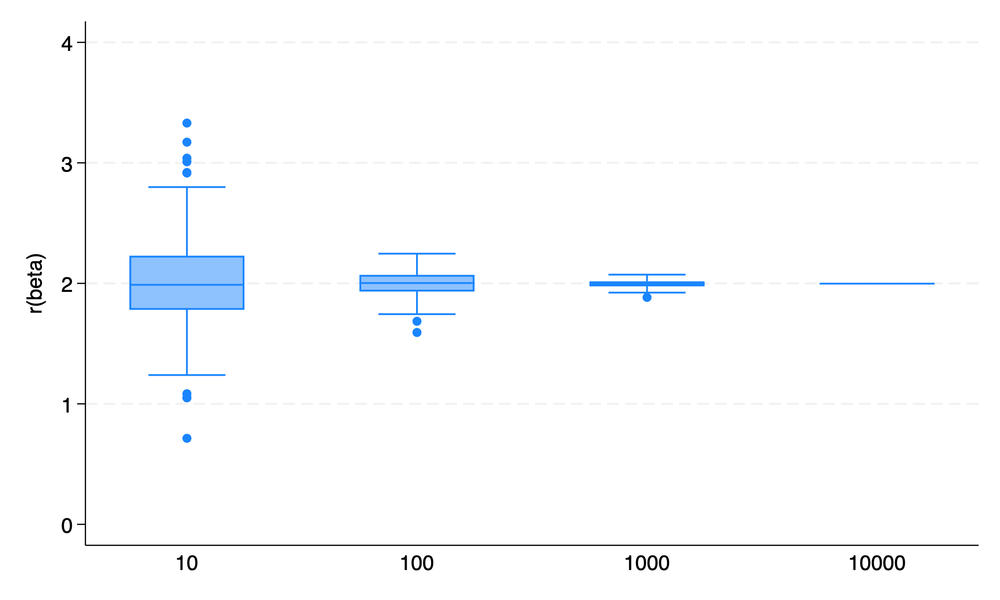
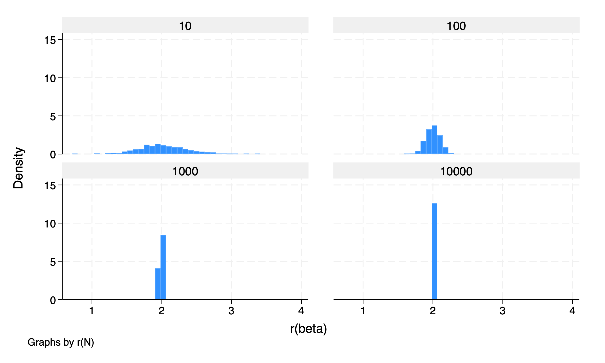
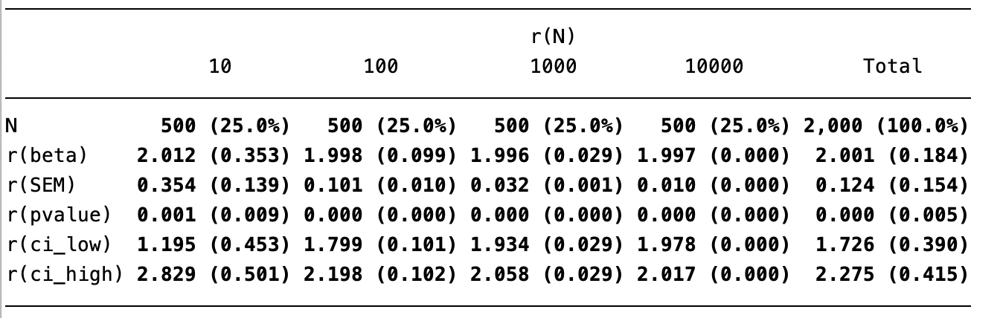
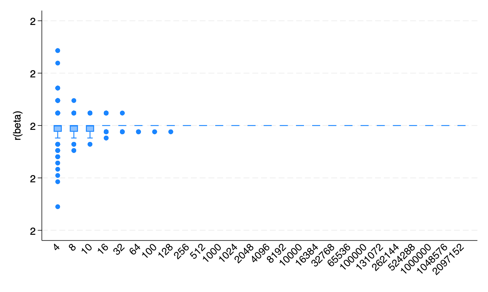
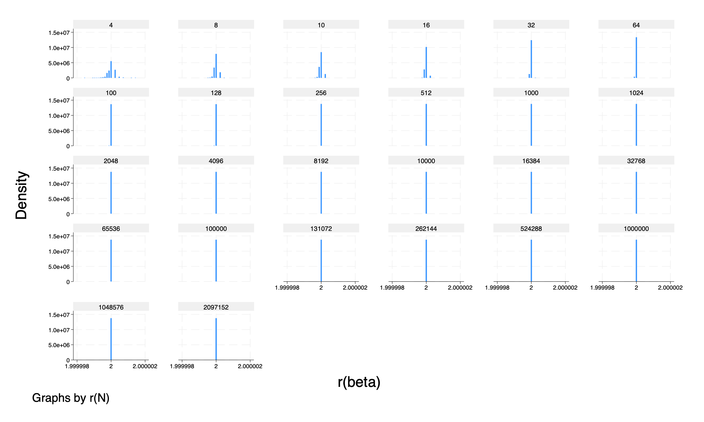
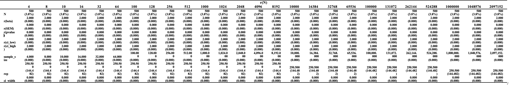

## 📊 Results Summary

As sample size `N` increases, we observe a clear pattern across all results:

### 🔹 Boxplot

The variability in beta estimates **narrows** significantly.  
- At `N = 10`, the estimates are widely dispersed with many outliers.  
- At `N = 10,000`, the distribution becomes extremely **tight around β ≈ 2**.

### 🔹 Histogram

The density becomes increasingly **peaked and narrow** with higher `N`,  
indicating **more precise estimates** centered around the true beta.

### Table

- The **Standard Error (SEM)** drops sharply:
  - From `0.354` at `N = 10`
  - To `0.010` at `N = 10,000`
- The **Confidence Interval (CI) width** also shrinks:
  - From approximately `1.63` to `0.039`

### ✅ Conclusion
Increasing the sample size leads to:
- More **precise**
- More **stable**
- More **reliable** beta estimates  
This is achieved by reducing **sampling variability** and **narrowing the confidence intervals**.

---

## 📈 Simulation Overview

This simulation explores how increasing **sample size** impacts the **precision of regression estimates** (β), measured via:

- **Standard Errors (SEM)**
- **Confidence Intervals (CI width)**

Results are presented in two parts:

- **Part 1**: `N = 10` to `10,000`
- **Part 2**: `N = 4` to over `2,000,000`

---
### 🔹 Part 2: Summary (`N = 4` to `2,097,152`)

- **Error Bar Graph**: Rapid convergence of β to `2.0`.  
  After `N > 1,000`, the variation becomes almost invisible.

- **Density Plots**: With very large N, the histograms become **extremely sharp peaks**, nearly vertical at `β = 2.0`.

- **Table**:

  - SEM and CI width both approach **zero** from `N ≈ 1,000` onward.
  - Estimated β remains exactly at `2.000` with virtually **no spread**.

📊 **Interpretation**: With sufficiently large samples, β is estimated **almost perfectly**, confirming theoretical expectations from statistics.

---

### 🔹 Why Can Part 2 Use Larger Sample Sizes?

- In **Part 1**, samples are drawn from a **fixed dataset**, such as drawing `N = 100` from a population of `10,000`.  
  This naturally **limits** how large N can get.

- In **Part 2**, we simulate data using a **data-generating process (DGP)**.  
  This means we can **"create" new data**, allowing us to sample at sizes like `1 million` or even `2 million` without any constraint.

📌 **Result**: Part 2 enables the demonstration of asymptotic properties of regression more clearly, as N can grow arbitrarily large.

---

``

