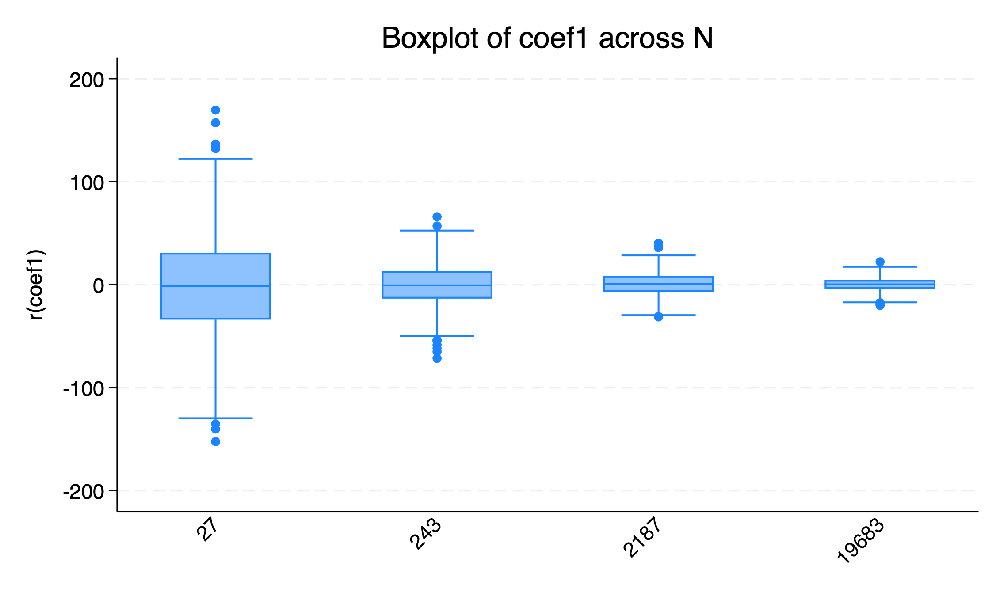
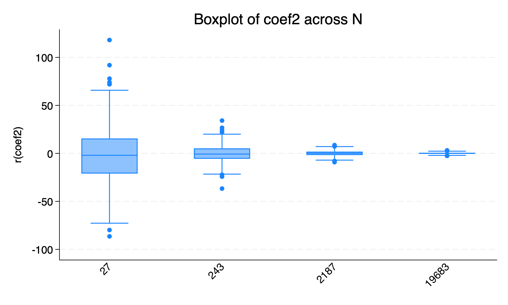
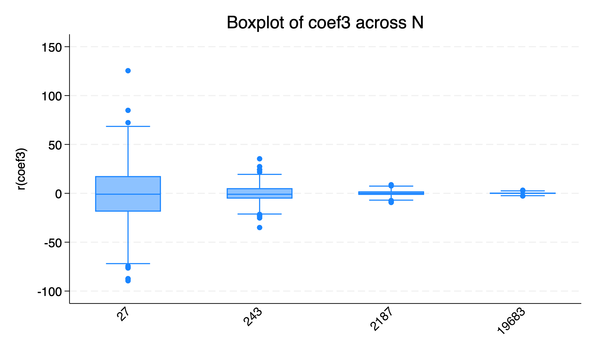
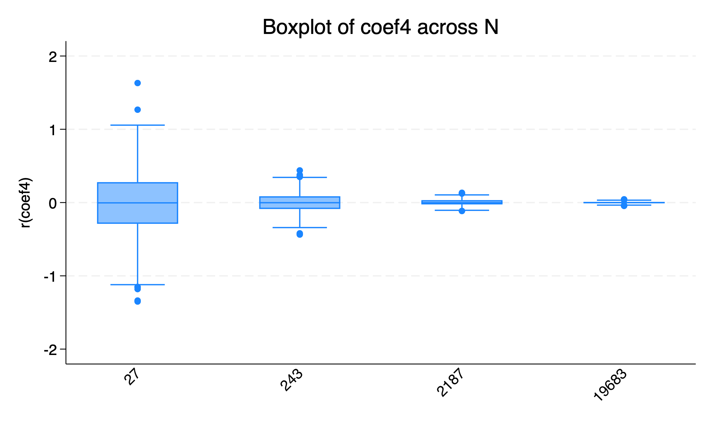

## Part Three: De-biasing a Parameter Estimate using Controls

### Summary

By setting up the covariates the way we did, we ensured that:
- **2/3 of the covariates directly influence treatment assignment**, and
- **2/3 directly influence the outcome (Y)**.

This setup creates overlap where some covariates are **confounders** (affect both treatment and outcome), while others are either **instruments** (affect only treatment) or **pure predictors** (affect only outcome). This makes the regression more realistic and highlights the role of covariate selection.

### 🧪 Approach

We estimated **five regression models** across increasing sample sizes to assess:
- **Bias in the treatment effect estimate (beta)**
- **Variance and convergence as N increases**

Each model incorporates a different set of controls and fixed effects:

| Model | Controls Included |
|-------|-------------------|
| 1     | Treatment only (no controls) |
| 2     | Treatment + Confounder |
| 3     | Model 2 + Outcome-only covariate |
| 4     | Model 3 + Instrument-like covariate |
| 5     | Model 4 + Strata Fixed Effects |

Each model was run across simulated datasets with sample sizes of:  
**N = 27, 243, 2187, 19683**.

### Results

All five models show a **decreasing spread and mean bias** as the sample size increases — evidence that **larger N improves estimate precision** and that **control variables matter**.  
Below are the coefficient plots for each model.

---

#### 📦 Model 1: No controls

> 📉 **Observation**: Extremely wide variance and heavy bias at small N. Stabilizes only at very large N.

---

#### 📦 Model 2: Add Confounder

> ✅ **Improved bias** and tighter distribution even at moderate N. Shows value of adjusting for confounders.

---

#### 📦 Model 3: Add Outcome-only Covariate

> 🧮 **Further reduction** in variance. Doesn't directly reduce bias, but improves efficiency.

---

#### 📦 Model 4: Add Instrument-only Covariate

> ⚠️ **No clear improvement**. Including variables that affect treatment but not outcome may increase variance.

---

#### 📦 Model 5: Add Strata Fixed Effects

> 🌟 **Best performance overall**. Least biased and lowest variance even at small-to-mid N.

---

### Conclusion

- **Model 5** performs best in terms of both bias and convergence speed.
- Including confounders is **essential** to unbiased estimation.
- Including unnecessary variables may **inflate variance**.
- **Strata fixed effects** significantly reduce noise from unobserved group-level heterogeneity.

